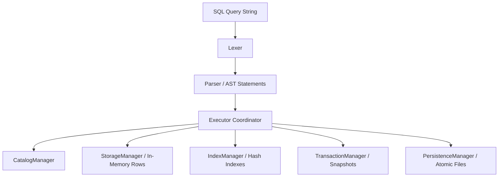

# NovaDB

NovaDB is a lightweight SQL database engine built from scratch in Java 21, designed to demonstrate core database concepts: lexical scanning, query parsing, index acceleration, transactional isolation, and persistent binary storage.

## Features & Architecture



### 1. Lexer & Parser
- **Lexical Scanner**: Custom character-stream tokenizer scanning identifiers, operators, and escaped string/numeric/boolean literals.
- **Recursive-Descent Parser**: Builds abstract syntax trees representing SQL commands and conditional comparisons (`=`, `!=`, `<`, `<=`, `>`, `>=`, `AND`, `OR`).

### 2. Transaction Manager (ACID)
- **Copy-On-Write Snapshotting**: Isolation of active transactions (`BEGIN`). Snapshots of catalog, storage tables, and indexes are taken in-memory.
- **Bypassed Disk Writes**: All DDL and DML operations execute in-memory, skipping file persistence writes.
- **Atomic Commits**: `COMMIT` flushes changes to disk. `ROLLBACK` restores the memory state to the original snapshots, fully discarding uncommitted changes.

### 3. Binary Persistence Manager
- **Atomic File Operations**: Crash-safe writes using POSIX-compliant atomic file moves. Writes are serialized to `.tmp` files first, then swapped.
- **Metadata Registry**: Schema details (columns, types, length boundaries) are saved in `metadata.ndb`.
- **Table Data Storage**: Rows are serialized in `<tableName>.ndb` using binary format structures with null cell padding indicators.

### 4. Hash Index
- **O(1) Search Lookups**: Speeds up selection queries matching `col = literal` conditions by directly extracting row positions.
- **Maintenance**: Auto-rebuilds index buckets upon table INSERT, UPDATE, or DELETE executions.
- **Persistence**: Index listings are serialized to `metadata.ndb`, and individual maps write to `<indexName>.idx`.

---

## SQL Syntax Reference

### 1. Database Definition (DDL)
- **Create Table**:
  ```sql
  CREATE TABLE users (id INT, email VARCHAR(50), active BOOLEAN);
  ```
- **Drop Table**:
  ```sql
  DROP TABLE users;
  ```
- **Create Index**:
  ```sql
  CREATE INDEX idx_email ON users (email);
  ```
- **Drop Index**:
  ```sql
  DROP INDEX idx_email;
  ```

### 2. Database Manipulation (DML)
- **Insert Rows**:
  ```sql
  INSERT INTO users VALUES (1, 'alice@test.com', true);
  INSERT INTO users (id, email) VALUES (2, 'bob@test.com');
  ```
- **Select Projections**:
  ```sql
  SELECT * FROM users WHERE active = true;
  SELECT id, email FROM users WHERE id = 1 ORDER BY email DESC LIMIT 1;
  ```
- **Update Records**:
  ```sql
  UPDATE users SET active = false WHERE id = 2;
  ```
- **Delete Records**:
  ```sql
  DELETE FROM users WHERE active = false;
  ```

### 3. Transaction Control
- **Begin active session**:
  ```sql
  BEGIN;
  ```
- **Commit changes**:
  ```sql
  COMMIT;
  ```
- **Revert session changes**:
  ```sql
  ROLLBACK;
  ```

---

## Compilation & Usage

### Requirements
- **JDK 21** or higher
- **Apache Maven 3.6+**

### 1. Build Shaded Jar
```bash
# Compile and create uber jar
mvn clean package
```

### 2. Start Interactive REPL
```bash
# Start console using data directory 'data'
java -jar target/novadb-1.0-SNAPSHOT.jar

# Or specify custom base folder
java -jar target/novadb-1.0-SNAPSHOT.jar --dir custom_data
```

Inside the console, you can execute SQL commands or type `.exit` to shutdown the engine.

### 3. Run Automated Tests
```bash
# Run unit and integration tests
mvn test
```
There are currently **63 integration tests** covering the lexer, parser, storage persistence, index search acceleration, and transaction isolation layers.
